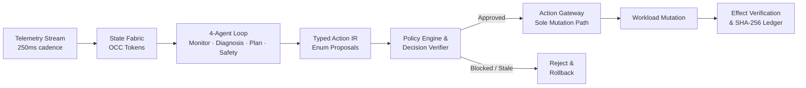

# ESA — Autonomous Payment Infrastructure Resilience

> **An autonomous incident remediation engine for payment gateways: neuro-symbolic and LLM agents diagnose multi-signal failures and propose joint recovery actions, while a deterministic Rust safety gate ensures zero unverified mutations.**

[](https://github.com/sujithputta02/Esapay/actions/workflows/ci.yml)
[](https://github.com/sujithputta02/Esapay/releases/latest)
[](https://www.npmjs.com/package/esapay)
[](https://www.npmjs.com/package/esapay-cli)
[](https://pypi.org/project/esapay/)
[](LICENSE)

[5-Min Demo Video](https://youtu.be/77qjP2yK7Og) · [Documentation](docs/README.md) · [Architecture](docs/architecture.md) · [Benchmarks](benchmarkreport.md) · [Contributing](CONTRIBUTING.md) · [License](LICENSE)

---

### Instant Install & Try

| Target | Package | Install Command | Quick Run |
|---|---|---|---|
| **Terminal CLI** | `esapay-cli` | `npm i -g esapay-cli` | `npx esapay-cli health` |
| **Node.js / Bun** | `esapay` | `npm i esapay` or `bun add esapay` | `import { EsaGateway } from 'esapay'` |
| **Python 3.8+** | `esapay` | `pip install esapay` or `uv add esapay` | `from esapay import EsaGateway` |

---

## Why This Exists

During flash sales, festival spikes, and payday surges, payment gateways face sudden traffic bursts coupled with downstream bank rail degradation (e.g., UPI bank outages). 

Traditional autoscalers (HPA / PID) react too late (3–5 minute scrape lag) and only know how to add pod replicas. When an upstream bank rail fails, adding pods simply fires **more concurrent requests into a dying bank rail**, triggering a catastrophic thundering-herd collapse. 

ESA replaces blind scaling with **governed autonomous remediation**: real-time streaming telemetry and neuro-symbolic reasoning diagnose the true root cause across heterogeneous signals, while a deterministic Rust safety gate ensures AI agents never have direct shell, `kubectl`, or unverified mutation access.

---

## Features

- ⚡ **Sub-2ms Reflex Reasoner:** Tier-1 ARC fluid reasoner induces minimal DSL remediation programs in <1ms to prevent queue buildup before checkouts fail.
- 🧠 **Contextual Multi-Signal Diagnosis:** Collaborative 4-agent loop (Monitor, Diagnosis, Planning, Safety) disambiguates pod CPU pressure from upstream bank outages.
- 🛡️ **Hard Deterministic Safety Gate:** Strict separation of powers — agents propose, but the Action Gateway enforces Optimistic Concurrency Control (OCC) and policy invariants.
- 🔄 **Multi-Gateway Autonomous Failover:** Real-time dynamic traffic shifting across payment corridors (Razorpay, PhonePe, Paytm, Cashfree) to preserve checkout completion.
- 📜 **Cryptographic Audit Ledger:** Immutable, append-only SHA-256 Merkle chain providing complete mathematical verification and deterministic replay.
- 🎛️ **Real-Time Command Center:** Responsive React dashboard and interactive terminal CLI streaming live latencies, agent deliberations, and corridor health.

---

## Quick Start

### Prerequisites

- **Rust 1.70+** (`cargo`)
- **Bun** or **Node.js 20+**
- **Docker** *(optional, for pre-warmed Ollama LLM container)*

---

### Option 1: 30-Second Terminal Test (Zero Setup)

Run the CLI immediately without cloning or building Rust:

```bash
# Verify cluster health
npx esapay-cli health

# Inspect multi-gateway corridors (Razorpay, PhonePe, Paytm, Cashfree)
npx esapay-cli gateways

# Execute an autonomous resilient checkout with automatic failover
npx esapay-cli checkout --amount 50000 --currency INR --gateway auto --method UPI

# Verify the SHA-256 Merkle audit chain
npx esapay-cli audit verify
```

---

### Option 2: Full Stack Local Development

#### 1. Clone & Configure

```bash
git clone https://github.com/sujithputta02/Esapay.git
cd Esapay
cp .env.example .env
```

#### 2. Start the LLM Engine (Ollama)

```bash
# Start pre-warmed Ollama container (runs in background)
make ollama-up
# Or run natively if you have Ollama installed locally:
# ollama serve && ollama run llama3.2:1b
```

#### 3. Run the Backend API & Control Plane

```bash
# Starts the Axum Rust engine on http://localhost:8080
cargo run --bin esa-api
```

#### 4. Launch the Command Center Dashboard

In a new terminal window:

```bash
cd frontend
bun install # or npm install
bun run dev # or npm run dev
```

Open **`http://localhost:3000`** in your browser to view the real-time Command Center.

---

### Option 3: Automated Demo Script

For macOS and Linux users, run all services (Backend, Simulator, Frontend) in coordinated terminal windows:

```bash
./start-demo.sh
```

| Service | Port | Description |
|---|---|---|
| **Command Center** | `http://localhost:3000` | Real-time monitoring and agent reasoning stream |
| **Payment Simulator** | `http://localhost:5173` | Interactive checkout testbed with Razorpay Test Mode |
| **Backend API** | `http://localhost:8080` | Rust control plane and autonomous action gateway |

---

## Usage Examples

### TypeScript / Node.js & Bun SDK

```typescript
import { EsaGateway } from 'esapay';

const esa = new EsaGateway({
  apiUrl: process.env.ESA_API_URL || 'http://localhost:8080',
});

// 1. Inspect live payment corridor latencies
const corridors = await esa.gateways.list();
console.table(corridors);

// 2. Execute a checkout with autonomous rail failover (₹500.00 via UPI)
const order = await esa.checkout({
  amount: 50000,   // Amount in paise
  currency: 'INR',
  gateway: 'auto', // Routes to optimal corridor; fails over if degraded
  method: 'UPI',
});

console.log(`Settled via: ${order.routed_gateway}`);
if (order.failover_triggered) {
  console.warn(`Autonomous failover reason: ${order.routing_reason}`);
}

// 3. Verify cryptographic SHA-256 audit ledger
const audit = await esa.audit.verifyChain();
console.log('Audit Integrity Valid:', audit.valid);
```

### Python SDK (Zero Dependencies)

```python
from esapay import EsaGateway

esa = EsaGateway(api_url="http://localhost:8080")

# 1. Check health
print("Status:", esa.health())

# 2. Execute resilient checkout
decision = esa.checkout(
    amount=50000,
    currency="INR",
    gateway="auto",
    method="UPI"
)

print(f"Settled via: {decision.routed_gateway} (Failover: {decision.failover_triggered})")
print(f"Transaction ID: {decision.transaction_id}")
```

---

## How It Works

### The Core Boundary

> **Agents propose. Deterministic infrastructure authorizes and executes.**



No agent has access to raw bash shells, `kubectl`, or network sockets. The Action Gateway is the only path that can mutate system state.

### The Four-Agent Collaborative Loop

| Agent | Responsibility | Execution Authority |
|---|---|---|
| **Monitor** | Continuous metric anomaly detection (P95 latency, queue backlog, error codes) | None (Read-only) |
| **Diagnosis** | Root-cause hypothesis via hybrid neuro-symbolic + local LLM reasoning | None (Advisory) |
| **Planning** | Joint remediation synthesis (`CREATE_REPLICA`, `SHIFT_ROUTE`, `ROLLBACK`) | None (Proposals only) |
| **Safety** | Risk grading and invariant pre-verification | None (Advisory) |

### Dual-Cadence Latency Architecture

To respect sub-second payment SLAs while benefiting from generative AI deliberation, ESA runs two distinct execution tracks:

```text
Incoming Telemetry Stream (250ms)
       │
       ├──► [Synchronous Critical Path (<2ms SLA)]
       │      Tier 1: ARC Fluid Reasoner (<1ms spatial induction)
       │      Tier 3: Pure Rust Deterministic Rules (<0.1ms fallback)
       │      └──► Immediate Action Gateway Execution
       │
       └──► [Asynchronous Deliberative Path (~1.8s background)]
              Tier 2: Local Ollama LLM (Deep semantic RCA & long-horizon strategy)
              └──► Strategic State & Policy Tuning
```

---

## Benchmark Evidence

Evaluated in a multi-seed benchmark harness across Kubernetes Kind pods and deterministic `StateFabric` workloads (155 evaluated runs):

| Metric | Static Rules (B0) | Adaptive Scaler (B1) | **ESA Autonomous Engine (B2)** | Value Delivered |
|---|---|---|---|---|
| **Time Above SLA (P95 > 250ms)** | 16.5 s | 14.8 s | **4.1 s** | **72.3% reduction in checkout failure window** |
| **P95 Tail Latency** | 236 ms | 257 ms | **156 ms** | **39.2% lower tail latency during surges** |
| **Stabilization & Drain** | 9.6 s | 7.2 s | **2.3 s** | **3.1x faster queue drainage** |
| **Detection Speed** | 15.0 s | 15.0 s | **250 ms** | **60x faster anomaly recognition** |
| **Adversarial Safety Violations** | 450 / 650 | 450 / 650 | **0 / 650** | **100% policy invariant preservation** |

> **Key Takeaway:** While standard scalers only look at pod metrics, ESA detects degraded upstream bank rails and executes joint actions (pod scale + route shift), bringing checkout latency below the SLA line in **4.1s vs 14.8s**.

See full methodology in [`benchmarkreport.md`](benchmarkreport.md) and [`docs/ESA_RBENCH_SPECIFICATION.md`](docs/ESA_RBENCH_SPECIFICATION.md).

---

## Project Structure

```text
ESA_paymentgateway/
├── crates/                  # Core Rust workspace
│   ├── esa-api/             # HTTP & WebSocket control plane server
│   ├── esa-core/            # Core domain models, actions, audit traits
│   ├── esa-state/           # In-memory StateFabric with OCC versioning
│   ├── esa-agents/          # 4-agent collaborative reasoning loop
│   ├── esa-policy/          # Deterministic invariant policy engine & verifier
│   ├── esa-gateway/         # Sole mutation execution engine with rollback
│   ├── esa-razorpay/        # Razorpay Test Mode gateway adapter
│   └── esa-cli/             # Native Rust CLI binary
├── arc_reasoner/            # Python neuro-symbolic fluid reasoner (<1ms)
├── packages/esa-cli/        # Published NPM universal CLI (esapay-cli)
├── sdk/
│   ├── typescript/          # Official TypeScript / Bun SDK (esapay)
│   └── python/              # Pure Python zero-dependency SDK (esapay)
├── frontend/                # React Command Center dashboard (Vite + Tailwind)
├── payment-simulator/       # Next.js interactive payment simulator
├── benchmarks/              # Reproducible test harnesses & scenario suites
└── docs/                    # Technical architecture & engineering guides
```

---

## Configuration

All configuration is managed via environment variables. Copy `.env.example` to get started:

```bash
cp .env.example .env
```

| Variable | Required | Default | Description |
|---|---|---|---|
| `OLLAMA_URL` | No | `http://localhost:11434` | Endpoint for Ollama LLM service |
| `OLLAMA_MODEL` | No | `llama3.2:1b` | Ollama model tag for semantic diagnosis |
| `RAZORPAY_KEY_ID` | No | *(Empty)* | Razorpay **Test Mode** Key ID (`rzp_test_...`) |
| `RAZORPAY_KEY_SECRET`| No | *(Empty)* | Razorpay Test Mode Secret |
| `RAZORPAY_WEBHOOK_SECRET` | No | *(Empty)* | Webhook signature verification secret |
| `KUBERNETES_ENABLED` | No | `false` | Enable optional `kubectl scale` integrations |
| `PORT` | No | `8080` | Backend API server port |

*Note: Never commit real production secrets or Razorpay Live Mode keys.*

---

## Known Boundaries & Limitations

To ensure absolute transparency and technical credibility:
- **Demo & Simulation Scope:** Benchmarks are conducted in synthetic flash-sale harnesses and local Kubernetes Kind pods.
- **State Storage:** The active runtime utilizes an in-memory `StateFabric`. PostgreSQL and Redis connectors exist in the workspace but are not wired to the primary runtime loop.
- **Compliance:** ESA does not claim PCI-DSS certification, RBI regulatory authorization, or live banking settlements.
- Read our full claims boundary in [`docs/claims.md`](docs/claims.md).

---

## Documentation

| Guide | Description |
|---|---|
| [System Architecture](docs/architecture.md) | In-depth walkthrough of the state fabric, gateway, and safety gates |
| [Dual-Cadence Reasoner](docs/AGI_REASONER_ARCHITECTURE_AND_CONSTRUCTION.md) | Neuro-symbolic ARC-AGI-3 priors and <1ms latency bounds |
| [ESA-RBench Specification](docs/ESA_RBENCH_SPECIFICATION.md) | 8-stage frontier evaluation ladder across hidden seeds |
| [Execution Lifecycle](docs/execution-flow.md) | Detailed trace of an incident from anomaly to post-verification |
| [API Reference](docs/api.md) | REST and WebSocket endpoints for gateway and telemetry |
| [Benchmark Methodology](benchmarks/methodology.md) | Reproducing multi-seed evaluations and adversarial suites |

---

## Contributing

Contributions, issues, and feature requests are welcome!
- Check out [CONTRIBUTING.md](CONTRIBUTING.md) for development workflows and testing requirements.
- Please adhere to our [Code of Conduct](CODE_OF_CONDUCT.md).
- For vulnerability reports, review our [Security Policy](SECURITY.md).

---

## License

This project is licensed under the [MIT License](LICENSE).  
Copyright (c) 2026 ESA Team.
