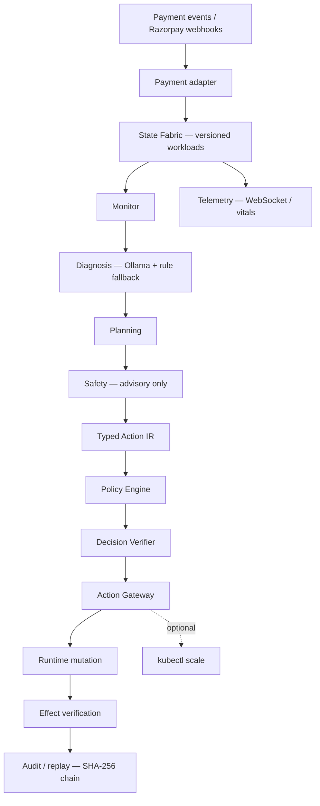

# ESA — Executable State Architecture

A governed adaptive runtime for payment workloads: LLM agents reason over live state and propose typed infrastructure actions, but **cannot** directly mutate infrastructure. Every change passes deterministic policy, optimistic concurrency, a single Action Gateway, effect verification, and a SHA-256 audit chain.

**Razorpay Buildathon 2026 — Open Track**

[](https://www.rust-lang.org/)
[](.github/workflows/ci.yml)
[](LICENSE)

---

## One-line thesis

> **Agents propose. Deterministic infrastructure decides and executes.**

Agents (Monitor, Diagnosis, Planning, Safety) produce `ActionProposal` values with embedded `state_version`, risk class, and expected effects. The Policy Engine, Decision Verifier, and Action Gateway approve, deny, or block before any workload mutation. No agent invokes shell, `kubectl`, or arbitrary infrastructure APIs.

---

## Why ESA?

Payment infrastructure fails in bursts: flash-sale traffic, regional skew, queue buildup, and SLA violations. Common responses fall short:

| Approach | Gap |
|----------|-----|
| Static rules | ~15s scrape-bound detection; coarse single-step scaling |
| Adaptive autoscalers | Faster scaling, but no governance layer for unsafe mutations |
| Ungoverned LLM ops | Contextual reasoning without OCC, policy, or typed actions |

ESA combines **contextual agent proposals** with **deterministic governance**, **controlled execution**, **post-mutation effect verification**, and **auditable replay** — validated in the local benchmark harness, not as production guarantees.

---

## What ESA does

1. **Ingest** payment events (synthetic API, Razorpay Test Mode webhooks/orders).
2. **Maintain** versioned workload state in `StateFabric` (optimistic concurrency).
3. **Run** a four-agent loop (~5s cadence): Monitor → Diagnosis → Planning → Safety.
4. **Emit** typed `ActionProposal` values (`CREATE_REPLICA`, `SHIFT_ROUTE`, `ROLLBACK`, …).
5. **Validate** through Policy Engine + Decision Verifier (ALLOW / DENY / STALE / REQUIRES_APPROVAL).
6. **Execute** only via the Action Gateway — the sole mutation path.
7. **Measure** expected vs observed effects after mutation.
8. **Record** SHA-256-chained audit events with deterministic replay (no LLM re-invocation).
9. **Optionally** scale Kubernetes deployments when Kind/cluster + env allow.

**Boundary:** LLM reasoning ends at the proposal. Deterministic infrastructure owns authorization and execution.

---

## Architecture



Agents **do not** call shell, `kubectl`, or free-form infrastructure APIs. Deep dive: [`docs/architecture.md`](docs/architecture.md) · [`docs/execution-flow.md`](docs/execution-flow.md)

---

## Safety & governance

### Typed Action IR

Infrastructure changes are enum-typed proposals — not scripts. Examples: `CREATE_REPLICA`, `SHIFT_ROUTE`, `ROLLBACK`.

### Optimistic concurrency (OCC)

Proposals embed `state_version`. Stale proposals are rejected (`STALE_STATE` / `RULE_003`) before mutation.

### Policy engine

Verdicts: **ALLOWED**, **DENIED**, **STALE_STATE**, **REQUIRES_APPROVAL** (high/critical risk blocks auto-exec).

### Action Gateway

**Sole execution path.** Policy + OCC + snapshot + audit run here.

### Effect verification

Post-execution comparison of expected vs observed metrics (`ObjectiveMet`, `Underperformed`, `Failed`).

### Rollback

Pre-execution snapshots; `ROLLBACK` restores numeric snapshot versions.

### Auditability

Append-only records with SHA-256 hash chaining; `GET /api/audit/verify-chain` and deterministic replay APIs.

> **Agents cannot directly mutate infrastructure.**

Details: [`docs/governance.md`](docs/governance.md) · [`docs/state-management.md`](docs/state-management.md) · [`docs/effect-verification.md`](docs/effect-verification.md) · [`docs/audit-replay.md`](docs/audit-replay.md)

---

## Four-agent architecture

| Agent | Responsibility | Direct execution |
|-------|----------------|------------------|
| Monitor | Condition detection (latency, queue, errors) | No |
| Diagnosis | Root-cause hypothesis (Ollama + rule fallback) | No |
| Planning | Typed `ActionProposal` synthesis | No |
| Safety | Risk advisory (gateway decides) | No |

Per-agent docs: [`docs/agents/monitor.md`](docs/agents/monitor.md) · [`docs/agents/diagnosis.md`](docs/agents/diagnosis.md) · [`docs/agents/planning.md`](docs/agents/planning.md) · [`docs/agents/safety.md`](docs/agents/safety.md)

---

## Demo

**Watch the 5-minute demo → [YouTube](https://youtu.be/77qjP2yK7Og)**

| Surface | URL / path |
|---------|------------|
| Command Center | http://localhost:3000 |
| Payment simulator (Razorpay Test Mode) | http://localhost:5173 |
| API + health | http://localhost:8080/health |
| Terminal narrative | [`scripts/demo.sh`](scripts/demo.sh) |
| Operator manual | [`docs/demo.md`](docs/demo.md) |
| Pitch script | [`FINAL_5MIN_DEMO_SCRIPT.md`](FINAL_5MIN_DEMO_SCRIPT.md) |

---

## Quick start

### Minimal — API only

```bash
cp .env.example .env
ollama serve   # optional; rule fallback if unavailable
cargo run --bin esa-api    # http://localhost:8080
```

### Full demo stack

```bash
cp .env.example .env
ollama serve
cargo run --bin esa-api                              # :8080
cd frontend && npm install && npm run dev            # :3000
cd payment-simulator && npm install && npm run dev   # :5173
```

One-shot: [`scripts/start-demo.sh`](scripts/start-demo.sh) · Smoke: [`scripts/run-demo-test.sh`](scripts/run-demo-test.sh)

More: [`docs/reproducibility.md`](docs/reproducibility.md) · [`docs/demo.md`](docs/demo.md)

---

## Benchmark results

Figures below are from the **local benchmark harness** (Docker + Kind optional, in-memory `StateFabric`). They are **not** production Razorpay traffic or SLA guarantees.

### Performance (B0 / B1 / B2 on identical scenarios, 5 seeds)

| Metric | B0 | B1 | B2 ESA |
|--------|----|----|--------|
| P95 tail latency | 236 ms | 257 ms | **156 ms** |
| Time above SLA (P95>250ms) | 16.5 s | 14.8 s | **4.1 s** |
| Stabilization | 9.6 s | 7.2 s | **2.3 s** |
| Detection latency | 15.0 s | 15.0 s | **250 ms** |
| Total recovery | 24.6 s | 22.2 s | 24.3 s |

ESA trades ~1.8s agent deliberation for faster detection, lower tail latency, and less time above SLA in these harness scenarios.

### Adversarial safety (650 identical attacks × 3 controllers)

Same attack vectors applied to B0, B1, and B2 (`make adversarial`):

| Controller | Unsafe mutations (of 650) |
|------------|---------------------------|
| B0 static rules | **450** |
| B1 adaptive | **450** |
| **B2 ESA** | **0** |

B2: 100 stale OCC rejects · 50/50 rollbacks · SHA-256 audit chain valid · live Ollama validation in suite when reachable.

Raw data: [`benchmarks/processed/adversarial_suite.json`](benchmarks/processed/adversarial_suite.json)

### Evidence & methodology

- Full report: [`benchmarkreport.md`](benchmarkreport.md)
- Summary: [`docs/benchmark-results.md`](docs/benchmark-results.md)
- Methodology: [`benchmarks/methodology.md`](benchmarks/methodology.md)
- Claims register: [`docs/claims.md`](docs/claims.md)

**Ablation note:** Three variants use live harness trials; four use arithmetic offsets from `Full_ESA` — see [`benchmarks/ablations.md`](benchmarks/ablations.md).

---

## Repository structure

```text
ESA_paymentgateway/
├── crates/
│   ├── esa-core/        # Types, actions, audit, intent
│   ├── esa-state/       # State fabric, snapshots, OCC
│   ├── esa-agents/      # Monitor, diagnosis, planning, safety
│   ├── esa-policy/      # Policy engine, verifier
│   ├── esa-gateway/     # Action gateway, rollback, optional K8s
│   ├── esa-runtime/     # Orchestrator loop
│   ├── esa-api/         # HTTP API, benchmark binaries
│   ├── esa-razorpay/    # Razorpay Test Mode adapter
│   └── esa-telemetry/   # Metrics helpers
├── frontend/            # Command Center (React + Vite)
├── payment-simulator/   # Next.js Razorpay checkout UI
├── benchmarks/          # Harness outputs, scenarios, docs
├── docs/                # Engineering documentation
├── scripts/             # Demo and test scripts
├── k8s/                 # Kubernetes manifests
├── benchmarkreport.md
├── docker-compose.yml
└── Makefile
```

---

## Technology stack

| Layer | Technology |
|-------|------------|
| Runtime / API | Rust, Axum, Tokio |
| Agents | Rust + Ollama (local LLM) |
| State | In-memory `StateFabric` + OCC |
| Governance | `esa-policy`, `esa-gateway` |
| Command Center | React, TypeScript, Vite, Tailwind |
| Payment UI | Next.js, Razorpay Checkout (Test Mode) |
| Optional infra | Docker Compose, Postgres, Redis, NATS, Prometheus, Grafana |
| Kubernetes | Kind, optional `kubectl scale` |
| CI | GitHub Actions ([`.github/workflows/ci.yml`](.github/workflows/ci.yml)) |

---

## Configuration

Copy [`.env.example`](.env.example) to `.env` — never commit secrets.

| Variable | Purpose |
|----------|---------|
| `OLLAMA_URL`, `OLLAMA_MODEL` | Diagnosis LLM |
| `RAZORPAY_KEY_ID`, `RAZORPAY_KEY_SECRET` | **Test Mode** only (`rzp_test_…`) |
| `RAZORPAY_WEBHOOK_SECRET` | Webhook signature verification |
| `KUBERNETES_ENABLED` | Optional `kubectl scale` side effects |
| `DATABASE_URL`, `REDIS_URL`, `NATS_URL` | Compose template — **not wired to API state today** |

---

## Reproducibility

```bash
make benchmark-quick      # smoke harness
make benchmark            # full B0/B1/B2 matrix
make adversarial          # 650-trial cross-controller safety suite
make audit-verify         # SHA-256 chain tamper test
make test                 # workspace tests
```

Details: [`docs/reproducibility.md`](docs/reproducibility.md) · [`benchmarks/README.md`](benchmarks/README.md)

---

## Current limitations

- In-memory state fabric (`PostgreSQL` `StateStore` exists but is **not** connected to the API)
- Redis / NATS defined in Compose — **not** used by the runtime loop
- No Prometheus `/metrics` endpoint on the API
- No automatic replan when effect verification reports `Failed`
- Four of seven ablation variants use **modeled offsets**, not live feature flags
- Audit trail is in-memory — not persisted across API restarts
- Benchmarks run in a **containerized demo environment**, not production payment traffic

**Not claimed:** production deployment, RBI/PCI compliance, real GMV protection, settlement, or security certifications.

Full register: [`docs/claims.md`](docs/claims.md)

---

## Security

- Never commit Razorpay **live** keys or production credentials
- Razorpay **Test Mode** only for this repository
- Use local `.env`; template is safe to commit
- Agents have **no** direct infrastructure execution privileges

[`SECURITY.md`](SECURITY.md)

---

## Documentation

| Topic | Link |
|-------|------|
| Index | [`docs/README.md`](docs/README.md) |
| Architecture | [`docs/architecture.md`](docs/architecture.md) |
| Execution flow | [`docs/execution-flow.md`](docs/execution-flow.md) |
| Governance | [`docs/governance.md`](docs/governance.md) |
| Agent model | [`docs/agent-model.md`](docs/agent-model.md) |
| Demo | [`docs/demo.md`](docs/demo.md) |
| Reproducibility | [`docs/reproducibility.md`](docs/reproducibility.md) |
| Benchmark results | [`docs/benchmark-results.md`](docs/benchmark-results.md) |
| Failure recovery | [`docs/failure-recovery.md`](docs/failure-recovery.md) |
| API | [`docs/api.md`](docs/api.md) |
| Claims register | [`docs/claims.md`](docs/claims.md) |
| PRD | [`docs/ESA_paymentprdv2.md`](docs/ESA_paymentprdv2.md) |
| Contributing | [`CONTRIBUTING.md`](CONTRIBUTING.md) |
| Changelog | [`CHANGELOG.md`](CHANGELOG.md) |

---

## License

MIT — see [LICENSE](LICENSE). Copyright (c) 2026 ESA Team.
