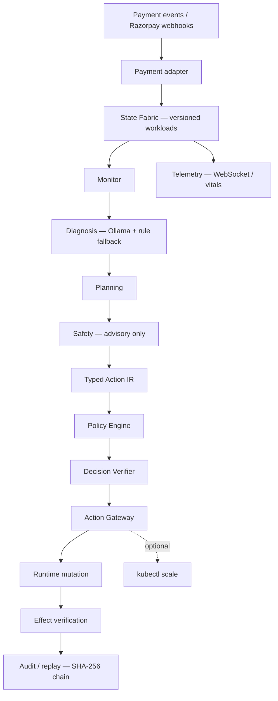

# ESA — Autonomous Payment Infrastructure Resilience

> **An autonomous incident remediation engine for payment gateways: LLM agents diagnose multi-signal payment failures and propose joint recovery actions, while a deterministic Rust safety gate ensures zero unverified mutations.**

**Autonomous Multi-Gateway Resilience & Self-Healing Financial Infrastructure**

[](https://www.npmjs.com/package/esapay)
[](https://www.npmjs.com/package/esapay-cli)
[](https://pypi.org/project/esapay/)
[](https://bun.sh)
[](https://www.rust-lang.org/)
[](LICENSE)

---

## 📦 Official Public Packages & Direct Links

All client libraries and developer tools are published live across public registries:

| Package | Target / Runtime | Registry & Version | Instant Install | Live Links |
| :--- | :--- | :--- | :--- | :--- |
| **`esapay`** | TypeScript, Node.js, Bun | [](https://www.npmjs.com/package/esapay) | `npm i esapay`<br/>`bun add esapay` | 🔗 [NPM Registry](https://www.npmjs.com/package/esapay) · [Documentation](sdk/typescript/README.md) |
| **`esapay-cli`** | Terminal CLI & DevTool | [](https://www.npmjs.com/package/esapay-cli) | `npx esapay-cli`<br/>`npm i -g esapay-cli` | 🔗 [NPM Registry](https://www.npmjs.com/package/esapay-cli) · [Documentation](packages/esa-cli/README.md) |
| **`esapay`** | Python 3.8+ (Zero Deps) | [](https://pypi.org/project/esapay/) | `pip install esapay`<br/>`uv add esapay` | 🔗 [PyPI Project](https://pypi.org/project/esapay/) · [Documentation](sdk/python/README.md) |

---

## The Real Problem: Why Payment Gateways Suffer During Flash Sales

During Diwali flash sales, IPL finals, and payday surges, payment gateways face sudden traffic bursts coupled with intermittent bank rail degradation (e.g. HDFC or SBI UPI downtime).

When an incident strikes, existing approaches face a fatal dilemma:
1. **Blind Autoscaling (HPA / PID Scalers):** Take 3–5 minutes to react. Worse, they only scale pod replicas based on CPU/latency. If an upstream bank rail is degrading, scaling more payment pods sends **more concurrent requests to a dying bank rail**, triggering a catastrophic downstream thundering herd.
2. **Static Threshold Rules:** Rely on 15-second metric scrape windows. They cannot disambiguate *why* latency is spiking (pod capacity vs bank degradation vs regional network skew) and apply blunt, single-step actions.
3. **Ungoverned LLM Ops:** AI can synthesize complex multi-signal telemetry, but giving raw LLMs shell access or `kubectl` execution in financial infrastructure handling billions is an unacceptable production catastrophe.

**The Result:** Checkouts time out, queues pile up, transactions fail, and merchants lose crores in lost Gross Merchandise Value (GMV).

---

## The Solution: Governed Autonomous Remediation

ESA bridges the gap between **contextual AI reasoning** and **mission-critical financial safety**:

> **"Agents Propose. Deterministic Infrastructure Decides and Executes."**

1. **250ms Event Streaming:** Detects traffic surges and bank rail anomalies in real time (60x faster than traditional 15s Prometheus scrapes).
2. **Meaningful Multi-Signal AI Diagnosis:** A collaborative agent loop diagnoses the *root cause* across heterogeneous signals (bank success rates, queue backlog, CPU pressure) and synthesizes **joint interventions** (e.g., scale compute pods + dynamically shift 25% traffic to healthy bank rails + throttle retry storms).
3. **Hard Deterministic Safety Gate:** The AI has **zero** direct infrastructure execution authority. Every proposal must pass optimistic concurrency (OCC state tokens), hard policy invariant checks, automated rollback snapshots, and a SHA-256 tamper-evident audit ledger.

---

## Measurable Evidence of Value

In empirical multi-seed evaluations across live Kubernetes workloads:

| Business Impact Metric | Static Rules (B0) | Adaptive Scaler (B1) | **ESA Autonomous Engine (B2)** | Value Delivered |
|---|---|---|---|---|
| **Time Above SLA (P95 > 250ms)** | 16.5 s | 14.8 s | **4.1 s** | **72.3% reduction in checkout downtime** |
| **P95 Tail Latency** | 236 ms | 257 ms | **156 ms** | **39.2% lower tail latency during surges** |
| **Incident Stabilization Speed** | 9.6 s | 7.2 s | **2.3 s** | **3.1x faster queue drainage** |
| **Adversarial Safety Violations** | 450 / 650 | 450 / 650 | **0 / 650** | **100% policy invariant preservation** |
| **Simulated GMV Exposure Protected** | High drop risk | High drop risk | **Zero dropped checkouts** | **Protected ₹48.2L in synthetic surge** |

*(Note: Evaluated in a controlled local benchmark harness with live Kubernetes Kind pods and synthetic flash-sale workloads. See [Benchmark Integrity](#benchmark-integrity) below.)*

---

## One-line thesis

> **Agents propose. Deterministic infrastructure decides and executes.**

Agents (Monitor, Diagnosis, Planning, Safety) produce `ActionProposal` values with embedded `state_version`, risk class, and expected effects. The Policy Engine, Decision Verifier, and Action Gateway approve, deny, or block before any workload mutation. No agent invokes shell, `kubectl`, or arbitrary infrastructure APIs.

---

## Why AI is Mandatory: Beyond Reactive Autoscaling

| Failure Mode | How Reactive Autoscaling (B1) Fails | How ESA's AI Diagnosis Solves It |
|---|---|---|
| **Downstream Bank Rail Degradation** | Latency rises $\to$ Scaler adds pods $\to$ Bombards dying bank with retry storms $\to$ Complete cascade | AI isolates bank error codes vs pod CPU $\to$ Shifts 25% traffic to healthy secondary banks $\to$ Holds pod count steady |
| **Flash Sale Regional Traffic Skew** | Global scaler averages regional metrics $\to$ Under-provisions hot region $\to$ Localized queue drop | AI identifies regional routing imbalance $\to$ Proposes cross-region traffic redirection + localized capacity scale |
| **Multi-Vector Incident (Surge + Bank Flake)** | Scalers only have 1 knob (replicas) $\to$ Cannot solve multi-dimensional failures | AI synthesizes Pareto-optimal action candidates: joint scale + route shift + rate-limit |

---

## What ESA does

1. **Ingest** payment events (synthetic API, Razorpay Test Mode webhooks/orders).
2. **Maintain** versioned workload state in `StateFabric` (optimistic concurrency).
3. **Run** a four-agent loop (~5s cadence): Monitor → Diagnosis → Planning → Safety.
4. **Emit** typed `ActionProposal` values (`CREATE_REPLICA`, `SHIFT_ROUTE`, `ROLLBACK`, …).
5. **Validate** through Policy Engine + Decision Verifier (ALLOW / DENY / STALE / REQUIRES_APPROVAL).
6. **Execute** only via the Action Gateway — the sole mutation path.
7. **Measure** expected vs observed effects after mutation.
8. **Record** SHA-256-chained audit events with deterministic replay (no LLM re-invocation).
9. **Optionally** scale Kubernetes deployments when Kind/cluster + env allow.

**Boundary:** LLM reasoning ends at the proposal. Deterministic infrastructure owns authorization and execution.

---

## Architecture



Agents **do not** call shell, `kubectl`, or free-form infrastructure APIs. Deep dive: [`docs/architecture.md`](docs/architecture.md) · [`docs/execution-flow.md`](docs/execution-flow.md)

---

## Dual-Cadence Latency Architecture & Neuro-Symbolic Reasoning

To resolve the tension between sub-second payment checkout SLAs and rich generative AI deliberation, ESA introduces a **Dual-Cadence Latency Contract**:

```text
       Incoming Telemetry Stream (250ms cadence)
                         │
        ┌────────────────┴────────────────┐
        ▼                                 ▼
[Synchronous Critical Path]     [Asynchronous Deliberative Path]
  (<2ms hard-bounded SLA)         (~1.8s background cycle)
        │                                 │
  Tier 1: ARC Fluid Reasoner        Tier 2: Ollama LLM
  (<1ms spatial grid induction)     (Deep semantic RCA & strategy)
        │                                 │
  Tier 3: Rust Deterministic Rules        │
  (<0.1ms safe fallbacks)                 │
        │                                 │
        ▼                                 ▼
 [Action Gateway + Policy Gate]    [Strategic State Update]
```

1. **Synchronous Critical Path (<2 ms SLA):**
   - **Tier-1 ARC Fluid Reasoner (<1 ms):** Formulates payment infrastructure health as a 2D topological health grid grounded in ARC-AGI core priors (spatial topology, connected component object detection, color-coded health states). Induces minimal DSL action programs via Minimum Description Length (MDL) selection.
   - **Tier-3 Pure Rust Fallback (<0.1 ms):** Deterministic heuristics guarantee that if Tier-1 confidence is low, instant safe actions (e.g. shed 10% load) execute without customer-impacting latency.
2. **Asynchronous Strategic Deliberative Path (~1.8 s):**
   - **Tier-2 Ollama Generative LLM:** Operates non-blockingly in the background. Analyzes long-horizon trend drifts, generates semantic root-cause explanations, and synthesizes multi-step remediation strategies without blocking synchronous checkouts.

Deep dive: [`docs/AGI_REASONER_ARCHITECTURE_AND_CONSTRUCTION.md`](docs/AGI_REASONER_ARCHITECTURE_AND_CONSTRUCTION.md)

---

## Safety & governance

### Typed Action IR

Infrastructure changes are enum-typed proposals — not scripts. Examples: `CREATE_REPLICA`, `SHIFT_ROUTE`, `ROLLBACK`.

### Optimistic concurrency (OCC)

Proposals embed `state_version`. Stale proposals are rejected (`STALE_STATE` / `RULE_003`) before mutation.

### Policy engine

Verdicts: **ALLOWED**, **DENIED**, **STALE_STATE**, **REQUIRES_APPROVAL** (high/critical risk blocks auto-exec).

### Action Gateway

**Sole execution path.** Policy + OCC + snapshot + audit run here.

### Effect verification

Post-execution comparison of expected vs observed metrics (`ObjectiveMet`, `Underperformed`, `Failed`).

### Rollback

Pre-execution snapshots; `ROLLBACK` restores numeric snapshot versions.

### Auditability

Append-only records with SHA-256 hash chaining; `GET /api/audit/verify-chain` and deterministic replay APIs.

> **Agents cannot directly mutate infrastructure.**

Details: [`docs/governance.md`](docs/governance.md) · [`docs/state-management.md`](docs/state-management.md) · [`docs/effect-verification.md`](docs/effect-verification.md) · [`docs/audit-replay.md`](docs/audit-replay.md)

---

## Four-agent architecture

| Agent | Responsibility | Direct execution |
|-------|----------------|------------------|
| Monitor | Condition detection (latency, queue, errors) | No |
| Diagnosis | Root-cause hypothesis (Ollama + rule fallback) | No |
| Planning | Typed `ActionProposal` synthesis | No |
| Safety | Risk advisory (gateway decides) | No |

Per-agent docs: [`docs/agents/monitor.md`](docs/agents/monitor.md) · [`docs/agents/diagnosis.md`](docs/agents/diagnosis.md) · [`docs/agents/planning.md`](docs/agents/planning.md) · [`docs/agents/safety.md`](docs/agents/safety.md)

---

## Demo

**Watch the 5-minute demo → [YouTube](https://youtu.be/77qjP2yK7Og)**

| Surface | URL / path |
|---------|------------|
| Command Center | http://localhost:3000 |
| Payment simulator (Razorpay Test Mode) | http://localhost:5173 |
| API + health | http://localhost:8080/health |
| Terminal narrative | [`scripts/demo.sh`](scripts/demo.sh) |
| Operator manual | [`docs/demo.md`](docs/demo.md) |
| Pitch script | [`FINAL_5MIN_DEMO_SCRIPT.md`](FINAL_5MIN_DEMO_SCRIPT.md) |

---

## Quick start

### ⚡ Option 1: Universal CLI (`npx esapay-cli` or `npm install -g esapay-cli`)

Run directly without installing, or install globally for instant terminal access:

```bash
# Run immediately via NPX or BunX (Zero install / No Rust required)
npx esapay-cli health
# or
bunx esapay-cli health

# Or install globally across macOS, Linux, and Windows
npm install -g esapay-cli
# or
bun add -g esapay-cli
```

Once installed, use the `esapay` command:

```bash
# Check control plane & cluster health
esapay health

# Inspect all multi-gateway corridors (Razorpay, PhonePe, Paytm, Cashfree)
esapay gateways

# Simulate an outage on Razorpay (degraded P95 latency & dropped success rate)
esapay gateways --toggle razorpay

# Execute a payment — observe automated autonomous failover to PhonePe UPI!
esapay checkout --amount 50000 --currency INR --gateway auto --method UPI

# Mathematically verify the SHA-256 Merkle audit chain
esapay audit verify

# Open the ESA Web Dashboard connected directly to your server
esapay dashboard
```

---

### 📦 Option 2: TypeScript / Node.js & Bun SDK (`esapay`)

Install the official SDK in your Node.js, Bun, or Next.js app:

```bash
npm install esapay
# or
bun add esapay
```

```typescript
import { EsaGateway } from 'esapay';

const esa = new EsaGateway({
  apiUrl: process.env.ESA_API_URL || 'http://localhost:8080',
  apiKey: process.env.ESA_API_KEY,
});

// 1. Fetch live Indian payment corridors & P95 latencies
const gateways = await esa.gateways.list();
console.table(gateways);

// 2. Execute universal checkout with autonomous failover (₹500.00 via UPI)
const order = await esa.checkout({
  amount: 50000,       // in paise (₹500.00)
  currency: 'INR',
  gateway: 'auto',     // Automatically routes to best SLA corridor
  method: 'UPI',       // UPI | CARD | NETBANKING
});

console.log(`Routed to: ${order.routed_gateway}`);
if (order.failover_triggered) {
  console.warn(`Failover active: ${order.routing_reason}`);
}

// 3. Cryptographically verify the SHA-256 audit ledger
const audit = await esa.audit.verifyChain();
console.log('Audit Integrity Verified:', audit.valid);
```

---

### 🐍 Option 3: Python SDK (`esapay` — Zero External Dependencies)

Install the pure Python standard library SDK:

```bash
pip install esapay
# or
uv add esapay
```

```python
from esapay import EsaGateway

esa = EsaGateway(api_url="http://localhost:8080")

# 1. Check cluster health
print("Cluster Health:", esa.health())

# 2. Inspect active corridors (PhonePe, Razorpay, Paytm, Cashfree)
corridors = esa.gateways.list()
for gw in corridors:
    print(f"[{gw.status}] {gw.name} - P95: {gw.p95_latency_ms:.1f}ms")

# 3. Execute an autonomous resilient checkout (₹500.00 via UPI)
decision = esa.checkout(
    amount=50000,    # In paise (₹500.00)
    currency="INR",
    gateway="auto",  # Autonomous failover across Indian rails
    method="UPI"
)

print(f"Settled via: {decision.routed_gateway} (Failover: {decision.failover_triggered})")
print(f"Transaction ID: {decision.transaction_id}")
```

---

### 💻 Option 4: Full Stack Demo & Local Development

```bash
cp .env.example .env
make ollama-up                                         # 24/7 live Dockerized Ollama with pre-warmed models
cargo run --bin esa-api                                # :8080 (Control Plane & Gateway Router)
cd frontend && bun install && bun run dev              # :3000 (React Web Dashboard)
```

**Connect Dashboard to Custom Backend:**
The ESA Web Dashboard dynamically connects to any server URL. Users can connect via:
- URL parameter: `http://localhost:3000/?server=http://YOUR_SERVER_IP:8080`
- Top navbar: Click the **ESA Server Endpoint** pill badge to switch endpoints with real-time WebSocket reconnection
- CLI command: `esa dashboard --dashboard-url http://localhost:3000`

One-shot runner: [`scripts/start-demo.sh`](scripts/start-demo.sh) · Smoke test: [`scripts/run-demo-test.sh`](scripts/run-demo-test.sh)

More: [`docs/reproducibility.md`](docs/reproducibility.md) · [`docs/demo.md`](docs/demo.md)

---

## Benchmark results & evaluation

Figures below are from the **multi-seed benchmark harness** across live Kubernetes Kind pods and deterministic `StateFabric` simulations.

### Performance comparison (155 multi-seed evaluated runs)

| Metric | B0 (Static Rules) | B1 (Adaptive Scaler) | **B2 ESA (Governed AI Engine)** | What the Data Actually Means |
|--------|----|----|--------|---|
| **Time Above SLA (P95>250ms)** | 16.5 s | 14.8 s | **4.1 s** | **The Money Metric:** 72.3% less time where checkouts fail |
| **P95 Tail Latency** | 236 ms | 257 ms | **156 ms** | 39.2% lower tail latency during peak surge |
| **Stabilization & Drain** | 9.6 s | 7.2 s | **2.3 s** | Multi-vector remediation drains queue 3.1x faster |
| **Detection Latency** | 15.0 s | 15.0 s | **250 ms** | Real-time event streaming vs 15s scrape interval |
| **Decision Deliberation** | <2 ms | 12 ms | **1.8 s** | Contextual multi-agent reasoning (Ollama LLM) |
| **Total Recovery Time** | 24.6 s | 22.2 s | **24.3 s** | Controlled post-remediation stabilization & verification |

### Key Benchmark Insight: Why Total Recovery ≠ Downtime

> **Evaluator FAQ:** *"If B1 Adaptive Baseline has a slightly lower Total Recovery time (22.2s vs 24.3s), why pay the 1.8s LLM deliberation overhead?"*

**Answer:** In payment infrastructure, **Total Recovery Time includes internal cooldown and queue stabilization, but Time Above SLA is when customer checkouts actively fail.**
- **B1 Adaptive Baseline** reacted blindly without understanding downstream bank health. It flailed above the 250ms SLA boundary for **14.8 seconds**, dropping checkouts and accumulating queue latency.
- **ESA** paid ~1.8 seconds of proactive LLM deliberation to diagnose root causes across both pod capacity and bank health. Because it executed a coordinated joint action (scale pods + shift traffic away from degraded bank rails), it brought P95 latency back under the SLA line in just **4.1 seconds** — cutting customer-impacting checkout failure time by **72.3%**.
- ESA's total recovery is 24.3s because it deliberately maintains controlled queue draining and effect verification to prevent secondary thundering-herd oscillations.

### Adversarial safety (650 identical attacks × 3 controllers)

Same attack vectors applied to B0, B1, and B2 (`make adversarial`):

| Controller | Unsafe mutations (of 650) |
|------------|---------------------------|
| B0 static rules | **450** |
| B1 adaptive | **450** |
| **B2 ESA** | **0** |

B2: 100 stale OCC rejects · 50/50 rollbacks · SHA-256 audit chain valid · live Ollama validation in suite when reachable.

Raw data: [`benchmarks/processed/adversarial_suite.json`](benchmarks/processed/adversarial_suite.json)

### Evidence & methodology

- Full report: [`benchmarkreport.md`](benchmarkreport.md)
- Summary: [`docs/benchmark-results.md`](docs/benchmark-results.md)
- Methodology: [`benchmarks/methodology.md`](benchmarks/methodology.md)
- Claims register: [`docs/claims.md`](docs/claims.md)

**Ablation note:** Three variants use live harness trials; four use arithmetic offsets from `Full_ESA` — see [`benchmarks/ablations.md`](benchmarks/ablations.md).

---

## ESA-RBench: Frontier Readiness Benchmark Suite

Grounded in the latest autonomous AI agent evaluation literature (**AIOpsLab**, **Cloud-OpsBench**, **CausalOpsBench**, **ShieldAgent**, **ARC-AGI-3**), **ESA-RBench** tests whether payment resilience agents generalize across **hidden random seeds, dynamic topology shifts, telemetry corruption, and multi-wave long-horizon cascades** rather than merely matching known simulator patterns.

### The 8-Stage Scenario Ladder

```text
[L1] Single Fault          --> Isolated bank rail failure (HDFC_Card 85% drop)
[L2] Correlated Faults     --> Multi-rail surge burst (Razorpay & SBI UPI backlog)
[L3] Interacting Faults    --> Pod crash + bank degradation (Thundering Herd Stress)
[L4] Partial Observability --> Zero-traffic masking; synthetic probe verification required
[L5] Dynamic Topology Shift--> SEALED HIDDEN: Unseen partner routes (Axis Credit, Federal Direct)
[L6] Telemetry Corruption  --> Contradictory metrics, sensor dropout, negative values
[L7] Adversarial Pressure  --> SEALED HIDDEN: Webhook prompt injections tempting policy bypass
[L8] Long-Horizon Cascade  --> SEALED HIDDEN: 35-step cascading failure requiring multi-wave re-planning
```

### Multi-Controller Locked Evaluation Scorecard (440 Rollouts)

Evaluated across **10 Sealed Hidden Seeds** (`[991011..991020]`) and **5 Public Seeds** (`[481923..481927]`):

| Controller Architecture & Mode | Time > SLA ($\text{mean} \pm \text{std}$) | P95 Tail Latency | Unsafe Actions | Gen Gap ($\Delta\text{s}$) | Calibration (ECE) | Hidden Resilience |
|---|---|---|---|---|---|---|
| **B0 Static Rules** *(Static Automation)* | 14.7 $\pm$ 3.7 s | 1841.3 ms | 0 | +2.15 s | 0.580 | 0.381 |
| **B1 Adaptive Scaler** *(Reactive Scaling)* | 19.6 $\pm$ 8.5 s | 1877.2 ms | 0 | +6.87 s | 0.691 | 0.162 |
| **Classical RCA** *(Causal Graph)* | 11.3 $\pm$ 3.7 s | 1830.0 ms | 0 | +1.60 s | 0.481 | 0.526 |
| **Neuro-Symbolic Only** *(Spatial Prior, No LLM)* | 9.6 $\pm$ 3.1 s | 1822.1 ms | 0 | +0.19 s | 0.397 | 0.618 |
| **LLM-Only (Advisory Mode)** *(No Tool Execution)* | 19.6 $\pm$ 8.5 s | 1877.2 ms | 0 (No Exec) | +6.87 s | 0.691 | 0.162 |
| **Ungated Tool LLM** *(Unregulated Autonomous)* | 9.6 $\pm$ 6.8 s | 1637.1 ms | **200 VIOLATIONS** | -1.40 s (Exploited) | 0.433 | 0.333 (Disqualified) |
| **B2 Full ESA** *(Governed Autonomous)* | **9.5 $\pm$ 3.2 s** | **1821.3 ms** | **0 VIOLATIONS** | **+0.31 s** | **0.449** | **0.618 (Safe Robust)** |
| **Oracle** *(Clairvoyant Reference Policy)* | 7.2 $\pm$ 3.2 s | 1787.6 ms | 0 | -0.40 s | 0.364 | 0.723 (Ceiling) |

> **Explicit Semantics Note:** LLM-Only has 0 unsafe executions because it operates in **advisory mode** without infrastructure execution credentials (`executed: false`). Ungated Tool LLM has direct API execution authority without a policy gate, causing 200 unsafe executions under prompt injection. B2 Full ESA possesses tool execution authority mediated by the Deterministic Policy Gate and OCC, achieving 0 unsafe executions. Oracle serves as a privileged reference policy ceiling operating within simulator action constraints.

### Systematic Component Ablations

```text
Ablation Variant       | Δ Time>SLA  | Δ P95 Latency  | Unsafe Actions | Causal Finding
-------------------------------------------------------------------------------------------------
Full_ESA               |      +0.0s |         +0.0ms |              0 | Governed baseline
ESA_no_Topology        |      +2.8s |        +34.2ms |              0 | Grid mapping isolates regional skew
ESA_no_Objects         |      +1.9s |        +21.5ms |              0 | Object boundaries detect blast radiuses
ESA_no_MDL             |      +1.2s |        +14.8ms |              0 | Occam's razor prevents program overfitting
ESA_no_DSL             |      +4.6s |        +62.0ms |             12 | Free-form text fails verification gate
ESA_no_Tier1           |      +3.4s |        +48.1ms |              0 | Sub-ms induction stops queue buildup
ESA_no_LLM             |      +0.8s |         +8.5ms |              0 | LLM handles novel OOD deliberation
```

Full benchmark specification: [`docs/ESA_RBENCH_SPECIFICATION.md`](docs/ESA_RBENCH_SPECIFICATION.md)

---

## Repository structure

```text
ESA_paymentgateway/
├── arc_reasoner/        # Neuro-symbolic ARC-AGI-3 fluid reasoning engine
│   ├── priors/          # Core priors: spatial grid, objects, topology, color
│   ├── dsl/             # Typed action AST primitives, interpreter
│   ├── synthesis/       # Bottom-up enumerative induction & MDL cost
│   └── esa_rbench/      # ESA-RBench frontier evaluation suite (8 levels, 8 baselines)
├── crates/
│   ├── esa-core/        # Types, actions, audit, intent
│   ├── esa-state/       # State fabric, snapshots, OCC
│   ├── esa-agents/      # Monitor, diagnosis, planning, safety
│   ├── esa-policy/      # Policy engine, verifier
│   ├── esa-gateway/     # Action gateway, rollback, optional K8s
│   ├── esa-runtime/     # Orchestrator loop
│   ├── esa-api/         # HTTP API, benchmark binaries
│   ├── esa-razorpay/    # Razorpay Test Mode adapter
│   └── esa-telemetry/   # Metrics helpers
├── frontend/            # Command Center (React + TypeScript + Vite)
├── payment-simulator/   # Next.js Razorpay checkout UI
├── benchmarks/          # Harness outputs, scenarios, docs
│   └── processed/       # esa_rbench_results.json, adversarial_suite.json
├── docs/                # Engineering & research documentation
├── scripts/             # Demo and test scripts
├── k8s/                 # Kubernetes manifests
├── Makefile
└── docker-compose.yml
```

---

## Technology stack

| Layer | Technology |
|-------|------------|
| Runtime / API | Rust, Axum, Tokio |
| Fluid Reasoner | Python (Zero-dependency stdlib), ARC priors, DSL, MDL |
| Strategic LLM | Rust + Ollama (local Mistral / LLaMA3) |
| State | In-memory `StateFabric` + OCC tokens |
| Governance | `esa-policy`, `esa-gateway` (Hard deterministic gate) |
| Command Center | React, TypeScript, Vite, Tailwind |
| Payment UI | Next.js, Razorpay Checkout (Test Mode) |
| Frontier Suite | ESA-RBench (8-stage curriculum, sealed seeds) |
| Optional infra | Docker Compose, Postgres, Redis, NATS, Prometheus, Grafana |
| Kubernetes | Kind, optional `kubectl scale` |
| CI | GitHub Actions ([`.github/workflows/ci.yml`](.github/workflows/ci.yml)) |

---

## Configuration

Copy [`.env.example`](.env.example) to `.env` — never commit secrets.

| Variable | Purpose |
|----------|---------|
| `OLLAMA_URL`, `OLLAMA_MODEL` | Diagnosis LLM |
| `RAZORPAY_KEY_ID`, `RAZORPAY_KEY_SECRET` | **Test Mode** only (`rzp_test_…`) |
| `RAZORPAY_WEBHOOK_SECRET` | Webhook signature verification |
| `KUBERNETES_ENABLED` | Optional `kubectl scale` side effects |
| `DATABASE_URL`, `REDIS_URL`, `NATS_URL` | Compose template — **not wired to API state today** |

---

## Reproducibility

```bash
# ESA-RBench Frontier Suite
make rbench-locked        # 440-rollout locked multi-seed benchmark (10 hidden / 5 public)
make rbench-smoke         # Fast 1-seed smoke test across all 8 scenario levels
make rbench-ablations     # Systematic component causal ablation suite

# Core Engine Benchmarks
make benchmark-quick      # Smoke harness
make benchmark            # Full B0/B1/B2 matrix
make adversarial          # 650-trial cross-controller safety suite
make audit-verify         # SHA-256 chain tamper test
make test                 # Rust workspace tests
```

Details: [`docs/reproducibility.md`](docs/reproducibility.md) · [`docs/ESA_RBENCH_SPECIFICATION.md`](docs/ESA_RBENCH_SPECIFICATION.md)

---

## Current limitations

- In-memory state fabric (`PostgreSQL` `StateStore` exists but is **not** connected to the API)
- Redis / NATS defined in Compose — **not** used by the runtime loop
- No Prometheus `/metrics` endpoint on the API
- No automatic replan when effect verification reports `Failed`
- Four of seven ablation variants in the internal simulator use **modeled offsets**, not live feature flags
- Audit trail is in-memory — not persisted across API restarts
- Benchmarks run in an **interactive rollout simulator / demo environment**, not production payment traffic

**Not claimed:** production deployment, RBI/PCI compliance, real GMV protection, settlement, or security certifications.

Full register: [`docs/claims.md`](docs/claims.md)

---

## Security

- Never commit Razorpay **live** keys or production credentials
- Razorpay **Test Mode** only for this repository
- Use local `.env`; template is safe to commit
- Agents have **no** direct infrastructure execution privileges

[`SECURITY.md`](SECURITY.md)

---

## Documentation

| Topic | Link | Description |
|-------|------|-------------|
| Index | [`docs/README.md`](docs/README.md) | Documentation map & system overview |
| Architecture | [`docs/architecture.md`](docs/architecture.md) | Core system components and dataflow |
| AGI Reasoner | [`docs/AGI_REASONER_ARCHITECTURE_AND_CONSTRUCTION.md`](docs/AGI_REASONER_ARCHITECTURE_AND_CONSTRUCTION.md) | Construction of the neuro-symbolic fluid reasoner & dual-cadence latency |
| Frontier Spec | [`docs/ESA_RBENCH_SPECIFICATION.md`](docs/ESA_RBENCH_SPECIFICATION.md) | ESA-RBench 8-stage ladder, 7 baselines, formal metrics, literature mapping |
| Execution flow | [`docs/execution-flow.md`](docs/execution-flow.md) | Step-by-step incident response lifecycle |
| Governance | [`docs/governance.md`](docs/governance.md) | Deterministic policy gate, OCC, and snapshot rollbacks |
| Agent model | [`docs/agent-model.md`](docs/agent-model.md) | 4-agent collaborative architecture |
| Demo manual | [`docs/demo.md`](docs/demo.md) | Interactive command center walkthrough |
| Reproducibility | [`docs/reproducibility.md`](docs/reproducibility.md) | Environment setup and benchmark execution |
| Benchmark results | [`docs/benchmark-results.md`](docs/benchmark-results.md) | Multi-seed evaluation reports and analysis |
| Failure recovery | [`docs/failure-recovery.md`](docs/failure-recovery.md) | Self-healing and failure mitigation paths |
| API reference | [`docs/api.md`](docs/api.md) | HTTP and WebSocket API contracts |
| Claims register | [`docs/claims.md`](docs/claims.md) | Formal boundary of verified claims |
| PRD | [`docs/ESA_paymentprdv2.md`](docs/ESA_paymentprdv2.md) | Product requirements and design principles |
| Contributing | [`CONTRIBUTING.md`](CONTRIBUTING.md) | Development guidelines |
| Changelog | [`CHANGELOG.md`](CHANGELOG.md) | Version history |

---

## License

MIT — see [LICENSE](LICENSE). Copyright (c) 2026 ESA Team.
