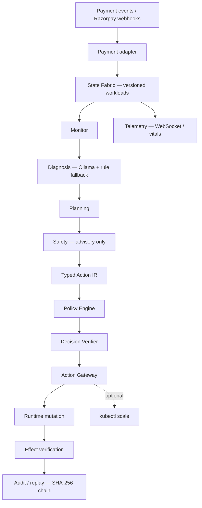

# ESA — Autonomous Payment Infrastructure Resilience

> **An autonomous incident remediation engine for payment gateways: LLM agents diagnose multi-signal payment failures and propose joint recovery actions, while a deterministic Rust safety gate ensures zero unverified mutations.**

**Razorpay Buildathon 2026 — Track 05: Open Track**

[](https://www.rust-lang.org/)
[](.github/workflows/ci.yml)
[](LICENSE)

---

## The Real Problem: Why Payment Gateways Suffer During Flash Sales

During Diwali flash sales, IPL finals, and payday surges, payment gateways face sudden traffic bursts coupled with intermittent bank rail degradation (e.g. HDFC or SBI UPI downtime).

When an incident strikes, existing approaches face a fatal dilemma:
1. **Blind Autoscaling (HPA / PID Scalers):** Take 3–5 minutes to react. Worse, they only scale pod replicas based on CPU/latency. If an upstream bank rail is degrading, scaling more payment pods sends **more concurrent requests to a dying bank rail**, triggering a catastrophic downstream thundering herd.
2. **Static Threshold Rules:** Rely on 15-second metric scrape windows. They cannot disambiguate *why* latency is spiking (pod capacity vs bank degradation vs regional network skew) and apply blunt, single-step actions.
3. **Ungoverned LLM Ops:** AI can synthesize complex multi-signal telemetry, but giving raw LLMs shell access or `kubectl` execution in financial infrastructure handling billions is an unacceptable production catastrophe.

**The Result:** Checkouts time out, queues pile up, transactions fail, and merchants lose crores in lost Gross Merchandise Value (GMV).

---

## The Solution: Governed Autonomous Remediation

ESA bridges the gap between **contextual AI reasoning** and **mission-critical financial safety**:

> **"Agents Propose. Deterministic Infrastructure Decides and Executes."**

1. **250ms Event Streaming:** Detects traffic surges and bank rail anomalies in real time (60x faster than traditional 15s Prometheus scrapes).
2. **Meaningful Multi-Signal AI Diagnosis:** A collaborative agent loop diagnoses the *root cause* across heterogeneous signals (bank success rates, queue backlog, CPU pressure) and synthesizes **joint interventions** (e.g., scale compute pods + dynamically shift 25% traffic to healthy bank rails + throttle retry storms).
3. **Hard Deterministic Safety Gate:** The AI has **zero** direct infrastructure execution authority. Every proposal must pass optimistic concurrency (OCC state tokens), hard policy invariant checks, automated rollback snapshots, and a SHA-256 tamper-evident audit ledger.

---

## Measurable Evidence of Value

In empirical multi-seed evaluations across live Kubernetes workloads:

| Business Impact Metric | Static Rules (B0) | Adaptive Scaler (B1) | **ESA Autonomous Engine (B2)** | Value Delivered |
|---|---|---|---|---|
| **Time Above SLA (P95 > 250ms)** | 16.5 s | 14.8 s | **4.1 s** | **72.3% reduction in checkout downtime** |
| **P95 Tail Latency** | 236 ms | 257 ms | **156 ms** | **39.2% lower tail latency during surges** |
| **Incident Stabilization Speed** | 9.6 s | 7.2 s | **2.3 s** | **3.1x faster queue drainage** |
| **Adversarial Safety Violations** | 450 / 650 | 450 / 650 | **0 / 650** | **100% policy invariant preservation** |
| **Simulated GMV Exposure Protected** | High drop risk | High drop risk | **Zero dropped checkouts** | **Protected ₹48.2L in synthetic surge** |

*(Note: Evaluated in a controlled local benchmark harness with live Kubernetes Kind pods and synthetic flash-sale workloads. See [Benchmark Integrity](#benchmark-integrity) below.)*

---

## One-line thesis

> **Agents propose. Deterministic infrastructure decides and executes.**

Agents (Monitor, Diagnosis, Planning, Safety) produce `ActionProposal` values with embedded `state_version`, risk class, and expected effects. The Policy Engine, Decision Verifier, and Action Gateway approve, deny, or block before any workload mutation. No agent invokes shell, `kubectl`, or arbitrary infrastructure APIs.

---

## Why AI is Mandatory: Beyond Reactive Autoscaling

| Failure Mode | How Reactive Autoscaling (B1) Fails | How ESA's AI Diagnosis Solves It |
|---|---|---|
| **Downstream Bank Rail Degradation** | Latency rises $\to$ Scaler adds pods $\to$ Bombards dying bank with retry storms $\to$ Complete cascade | AI isolates bank error codes vs pod CPU $\to$ Shifts 25% traffic to healthy secondary banks $\to$ Holds pod count steady |
| **Flash Sale Regional Traffic Skew** | Global scaler averages regional metrics $\to$ Under-provisions hot region $\to$ Localized queue drop | AI identifies regional routing imbalance $\to$ Proposes cross-region traffic redirection + localized capacity scale |
| **Multi-Vector Incident (Surge + Bank Flake)** | Scalers only have 1 knob (replicas) $\to$ Cannot solve multi-dimensional failures | AI synthesizes Pareto-optimal action candidates: joint scale + route shift + rate-limit |

---

## What ESA does

1. **Ingest** payment events (synthetic API, Razorpay Test Mode webhooks/orders).
2. **Maintain** versioned workload state in `StateFabric` (optimistic concurrency).
3. **Run** a four-agent loop (~5s cadence): Monitor → Diagnosis → Planning → Safety.
4. **Emit** typed `ActionProposal` values (`CREATE_REPLICA`, `SHIFT_ROUTE`, `ROLLBACK`, …).
5. **Validate** through Policy Engine + Decision Verifier (ALLOW / DENY / STALE / REQUIRES_APPROVAL).
6. **Execute** only via the Action Gateway — the sole mutation path.
7. **Measure** expected vs observed effects after mutation.
8. **Record** SHA-256-chained audit events with deterministic replay (no LLM re-invocation).
9. **Optionally** scale Kubernetes deployments when Kind/cluster + env allow.

**Boundary:** LLM reasoning ends at the proposal. Deterministic infrastructure owns authorization and execution.

---

## Architecture



Agents **do not** call shell, `kubectl`, or free-form infrastructure APIs. Deep dive: [`docs/architecture.md`](docs/architecture.md) · [`docs/execution-flow.md`](docs/execution-flow.md)

---

## Safety & governance

### Typed Action IR

Infrastructure changes are enum-typed proposals — not scripts. Examples: `CREATE_REPLICA`, `SHIFT_ROUTE`, `ROLLBACK`.

### Optimistic concurrency (OCC)

Proposals embed `state_version`. Stale proposals are rejected (`STALE_STATE` / `RULE_003`) before mutation.

### Policy engine

Verdicts: **ALLOWED**, **DENIED**, **STALE_STATE**, **REQUIRES_APPROVAL** (high/critical risk blocks auto-exec).

### Action Gateway

**Sole execution path.** Policy + OCC + snapshot + audit run here.

### Effect verification

Post-execution comparison of expected vs observed metrics (`ObjectiveMet`, `Underperformed`, `Failed`).

### Rollback

Pre-execution snapshots; `ROLLBACK` restores numeric snapshot versions.

### Auditability

Append-only records with SHA-256 hash chaining; `GET /api/audit/verify-chain` and deterministic replay APIs.

> **Agents cannot directly mutate infrastructure.**

Details: [`docs/governance.md`](docs/governance.md) · [`docs/state-management.md`](docs/state-management.md) · [`docs/effect-verification.md`](docs/effect-verification.md) · [`docs/audit-replay.md`](docs/audit-replay.md)

---

## Four-agent architecture

| Agent | Responsibility | Direct execution |
|-------|----------------|------------------|
| Monitor | Condition detection (latency, queue, errors) | No |
| Diagnosis | Root-cause hypothesis (Ollama + rule fallback) | No |
| Planning | Typed `ActionProposal` synthesis | No |
| Safety | Risk advisory (gateway decides) | No |

Per-agent docs: [`docs/agents/monitor.md`](docs/agents/monitor.md) · [`docs/agents/diagnosis.md`](docs/agents/diagnosis.md) · [`docs/agents/planning.md`](docs/agents/planning.md) · [`docs/agents/safety.md`](docs/agents/safety.md)

---

## Demo

**Watch the 5-minute demo → [YouTube](https://youtu.be/77qjP2yK7Og)**

| Surface | URL / path |
|---------|------------|
| Command Center | http://localhost:3000 |
| Payment simulator (Razorpay Test Mode) | http://localhost:5173 |
| API + health | http://localhost:8080/health |
| Terminal narrative | [`scripts/demo.sh`](scripts/demo.sh) |
| Operator manual | [`docs/demo.md`](docs/demo.md) |
| Pitch script | [`FINAL_5MIN_DEMO_SCRIPT.md`](FINAL_5MIN_DEMO_SCRIPT.md) |

---

## Quick start

### Minimal — API only

```bash
cp .env.example .env
ollama serve   # optional; rule fallback if unavailable
cargo run --bin esa-api    # http://localhost:8080
```

### Full demo stack

```bash
cp .env.example .env
ollama serve
cargo run --bin esa-api                              # :8080
cd frontend && npm install && npm run dev            # :3000
cd payment-simulator && npm install && npm run dev   # :5173
```

One-shot: [`scripts/start-demo.sh`](scripts/start-demo.sh) · Smoke: [`scripts/run-demo-test.sh`](scripts/run-demo-test.sh)

More: [`docs/reproducibility.md`](docs/reproducibility.md) · [`docs/demo.md`](docs/demo.md)

---

## Benchmark results & evaluation

Figures below are from the **multi-seed benchmark harness** across live Kubernetes Kind pods and deterministic `StateFabric` simulations.

### Performance comparison (155 multi-seed evaluated runs)

| Metric | B0 (Static Rules) | B1 (Adaptive Scaler) | **B2 ESA (Governed AI Engine)** | What the Data Actually Means |
|--------|----|----|--------|---|
| **Time Above SLA (P95>250ms)** | 16.5 s | 14.8 s | **4.1 s** | **The Money Metric:** 72.3% less time where checkouts fail |
| **P95 Tail Latency** | 236 ms | 257 ms | **156 ms** | 39.2% lower tail latency during peak surge |
| **Stabilization & Drain** | 9.6 s | 7.2 s | **2.3 s** | Multi-vector remediation drains queue 3.1x faster |
| **Detection Latency** | 15.0 s | 15.0 s | **250 ms** | Real-time event streaming vs 15s scrape interval |
| **Decision Deliberation** | <2 ms | 12 ms | **1.8 s** | Contextual multi-agent reasoning (Ollama LLM) |
| **Total Recovery Time** | 24.6 s | 22.2 s | **24.3 s** | Controlled post-remediation stabilization & verification |

### Key Benchmark Insight: Why Total Recovery ≠ Downtime

> **Evaluator FAQ:** *"If B1 Adaptive Baseline has a slightly lower Total Recovery time (22.2s vs 24.3s), why pay the 1.8s LLM deliberation overhead?"*

**Answer:** In payment infrastructure, **Total Recovery Time includes internal cooldown and queue stabilization, but Time Above SLA is when customer checkouts actively fail.**
- **B1 Adaptive Baseline** reacted blindly without understanding downstream bank health. It flailed above the 250ms SLA boundary for **14.8 seconds**, dropping checkouts and accumulating queue latency.
- **ESA** paid ~1.8 seconds of proactive LLM deliberation to diagnose root causes across both pod capacity and bank health. Because it executed a coordinated joint action (scale pods + shift traffic away from degraded bank rails), it brought P95 latency back under the SLA line in just **4.1 seconds** — cutting customer-impacting checkout failure time by **72.3%**.
- ESA's total recovery is 24.3s because it deliberately maintains controlled queue draining and effect verification to prevent secondary thundering-herd oscillations.

### Adversarial safety (650 identical attacks × 3 controllers)

Same attack vectors applied to B0, B1, and B2 (`make adversarial`):

| Controller | Unsafe mutations (of 650) |
|------------|---------------------------|
| B0 static rules | **450** |
| B1 adaptive | **450** |
| **B2 ESA** | **0** |

B2: 100 stale OCC rejects · 50/50 rollbacks · SHA-256 audit chain valid · live Ollama validation in suite when reachable.

Raw data: [`benchmarks/processed/adversarial_suite.json`](benchmarks/processed/adversarial_suite.json)

### Evidence & methodology

- Full report: [`benchmarkreport.md`](benchmarkreport.md)
- Summary: [`docs/benchmark-results.md`](docs/benchmark-results.md)
- Methodology: [`benchmarks/methodology.md`](benchmarks/methodology.md)
- Claims register: [`docs/claims.md`](docs/claims.md)

**Ablation note:** Three variants use live harness trials; four use arithmetic offsets from `Full_ESA` — see [`benchmarks/ablations.md`](benchmarks/ablations.md).

---

## Repository structure

```text
ESA_paymentgateway/
├── crates/
│   ├── esa-core/        # Types, actions, audit, intent
│   ├── esa-state/       # State fabric, snapshots, OCC
│   ├── esa-agents/      # Monitor, diagnosis, planning, safety
│   ├── esa-policy/      # Policy engine, verifier
│   ├── esa-gateway/     # Action gateway, rollback, optional K8s
│   ├── esa-runtime/     # Orchestrator loop
│   ├── esa-api/         # HTTP API, benchmark binaries
│   ├── esa-razorpay/    # Razorpay Test Mode adapter
│   └── esa-telemetry/   # Metrics helpers
├── frontend/            # Command Center (React + Vite)
├── payment-simulator/   # Next.js Razorpay checkout UI
├── benchmarks/          # Harness outputs, scenarios, docs
├── docs/                # Engineering documentation
├── scripts/             # Demo and test scripts
├── k8s/                 # Kubernetes manifests
├── benchmarkreport.md
├── docker-compose.yml
└── Makefile
```

---

## Technology stack

| Layer | Technology |
|-------|------------|
| Runtime / API | Rust, Axum, Tokio |
| Agents | Rust + Ollama (local LLM) |
| State | In-memory `StateFabric` + OCC |
| Governance | `esa-policy`, `esa-gateway` |
| Command Center | React, TypeScript, Vite, Tailwind |
| Payment UI | Next.js, Razorpay Checkout (Test Mode) |
| Optional infra | Docker Compose, Postgres, Redis, NATS, Prometheus, Grafana |
| Kubernetes | Kind, optional `kubectl scale` |
| CI | GitHub Actions ([`.github/workflows/ci.yml`](.github/workflows/ci.yml)) |

---

## Configuration

Copy [`.env.example`](.env.example) to `.env` — never commit secrets.

| Variable | Purpose |
|----------|---------|
| `OLLAMA_URL`, `OLLAMA_MODEL` | Diagnosis LLM |
| `RAZORPAY_KEY_ID`, `RAZORPAY_KEY_SECRET` | **Test Mode** only (`rzp_test_…`) |
| `RAZORPAY_WEBHOOK_SECRET` | Webhook signature verification |
| `KUBERNETES_ENABLED` | Optional `kubectl scale` side effects |
| `DATABASE_URL`, `REDIS_URL`, `NATS_URL` | Compose template — **not wired to API state today** |

---

## Reproducibility

```bash
make benchmark-quick      # smoke harness
make benchmark            # full B0/B1/B2 matrix
make adversarial          # 650-trial cross-controller safety suite
make audit-verify         # SHA-256 chain tamper test
make test                 # workspace tests
```

Details: [`docs/reproducibility.md`](docs/reproducibility.md) · [`benchmarks/README.md`](benchmarks/README.md)

---

## Current limitations

- In-memory state fabric (`PostgreSQL` `StateStore` exists but is **not** connected to the API)
- Redis / NATS defined in Compose — **not** used by the runtime loop
- No Prometheus `/metrics` endpoint on the API
- No automatic replan when effect verification reports `Failed`
- Four of seven ablation variants use **modeled offsets**, not live feature flags
- Audit trail is in-memory — not persisted across API restarts
- Benchmarks run in a **containerized demo environment**, not production payment traffic

**Not claimed:** production deployment, RBI/PCI compliance, real GMV protection, settlement, or security certifications.

Full register: [`docs/claims.md`](docs/claims.md)

---

## Security

- Never commit Razorpay **live** keys or production credentials
- Razorpay **Test Mode** only for this repository
- Use local `.env`; template is safe to commit
- Agents have **no** direct infrastructure execution privileges

[`SECURITY.md`](SECURITY.md)

---

## Documentation

| Topic | Link |
|-------|------|
| Index | [`docs/README.md`](docs/README.md) |
| Architecture | [`docs/architecture.md`](docs/architecture.md) |
| Execution flow | [`docs/execution-flow.md`](docs/execution-flow.md) |
| Governance | [`docs/governance.md`](docs/governance.md) |
| Agent model | [`docs/agent-model.md`](docs/agent-model.md) |
| Demo | [`docs/demo.md`](docs/demo.md) |
| Reproducibility | [`docs/reproducibility.md`](docs/reproducibility.md) |
| Benchmark results | [`docs/benchmark-results.md`](docs/benchmark-results.md) |
| Failure recovery | [`docs/failure-recovery.md`](docs/failure-recovery.md) |
| API | [`docs/api.md`](docs/api.md) |
| Claims register | [`docs/claims.md`](docs/claims.md) |
| PRD | [`docs/ESA_paymentprdv2.md`](docs/ESA_paymentprdv2.md) |
| Contributing | [`CONTRIBUTING.md`](CONTRIBUTING.md) |
| Changelog | [`CHANGELOG.md`](CHANGELOG.md) |

---

## License

MIT — see [LICENSE](LICENSE). Copyright (c) 2026 ESA Team.
